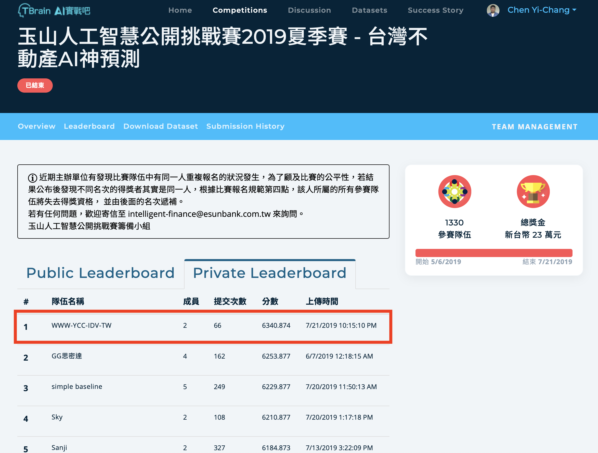
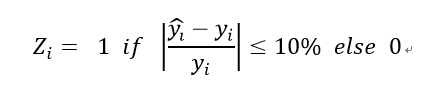
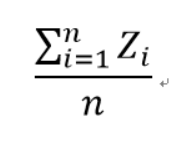
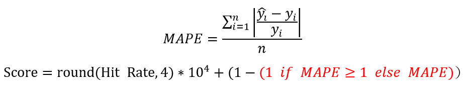
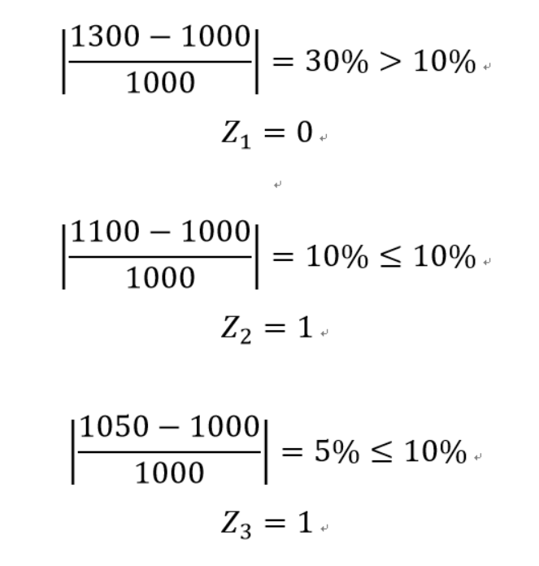
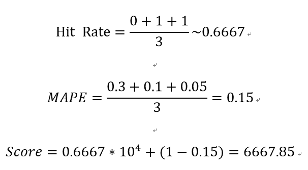

# TBrain: House Price Predict

## Abstract

Our team "WWW-YCC-IDV-TW" won **No. 1** in the game [玉山人工智慧公開挑戰賽2019夏季賽 - 台灣不動產AI神預測](https://tbrain.trendmicro.com.tw/Competitions/Details/6).  
This repo shows our method.  
  

## Rule

國外關於自動估價系統（Automated Valuation Model, AVM）研究對模型準確度好壞之判定，多以命中率（Hit-Ratio或Hit-Rate）為標準。  
Hit-Rate 表示有多少比例個案之估值誤差低於某一誤差水準值（本次競賽為10%），Hit-Rate 愈高表示模型精確度愈高。  
Hit-Rate的計算共分為兩步驟，首先比對各筆不動產預測和真實價格的誤差水準是否小於等於 10%，若是，則為 1；若否，則為 0。  

最終將各數值取平均，得到最終的Hit-Rate：  

不過考量到Hit Rate可能出現同分的情形，因此本次比賽採用 Hit Rate 結合 MAPE 作為最終的評分方式：  

舉例：  
假設測試集一共有三筆不動產的資訊，且您預測三筆不動產總價依序為1300、1100和1050萬，若此三筆不動產真實價格皆為1000萬，則Hit-Rate為：  

## Download Dataset

Please download dataset before you start to excute this program.  

Here: [https://www.kaggle.com/qi4589746/e-sun-ai-house-price](https://www.kaggle.com/qi4589746/e-sun-ai-house-price)

